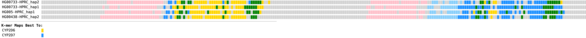

# KmerShade
Color genes/ sequences over locus.

This pipeline takes in two fastas, one with sample sequences over a locus, and the other with sub-sequences (e.g. genes) within the locus.
It divides the sample sequences into k-mers, aligns these to the gene sequences using minimap2, and colors each k-mer according to which gene it maps best to.

Alignment and plotting options are specified in the config file.

Example plot for CYP2D6-7 locus:

